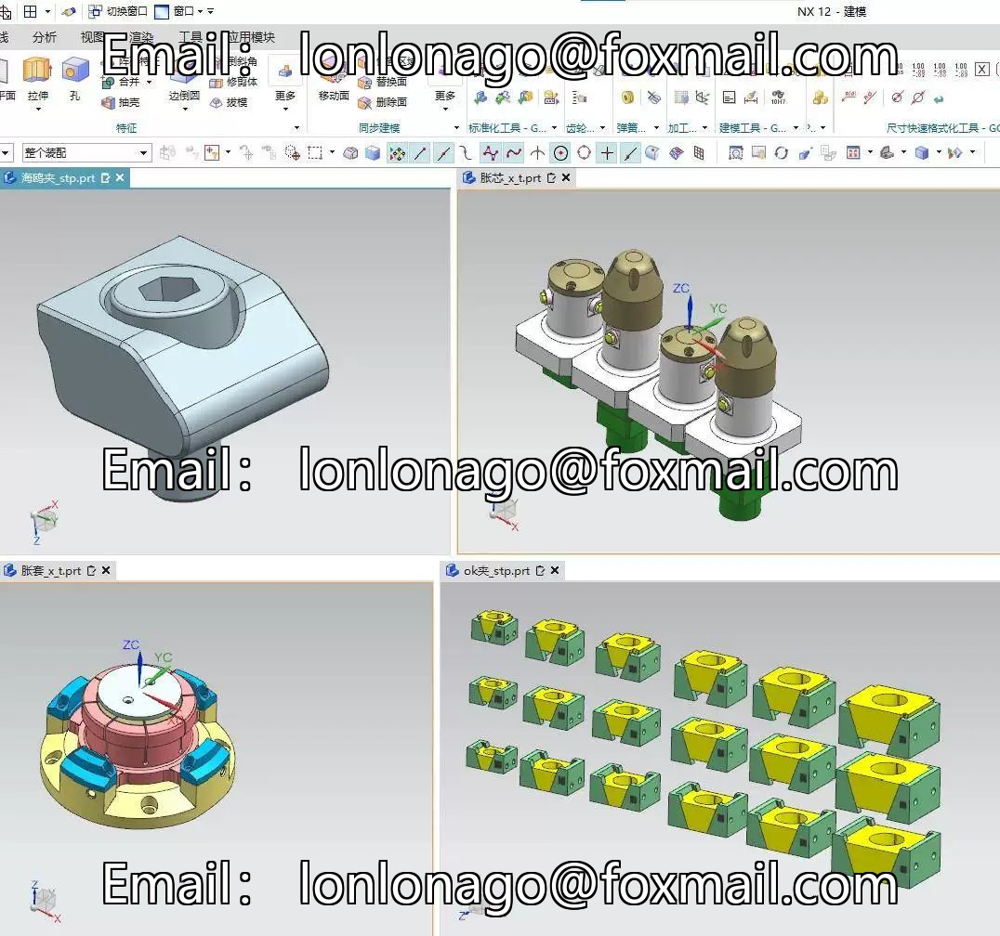
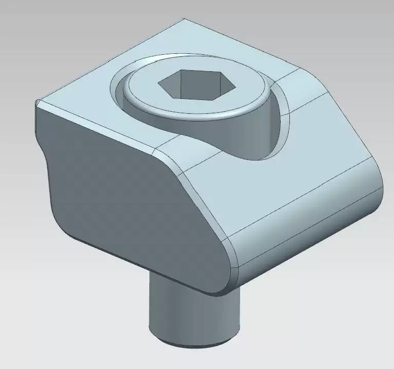
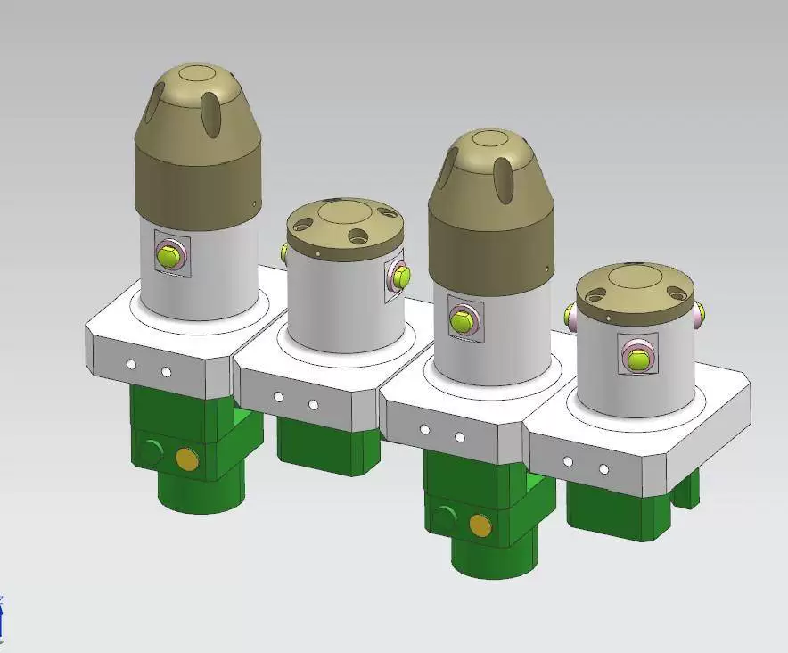
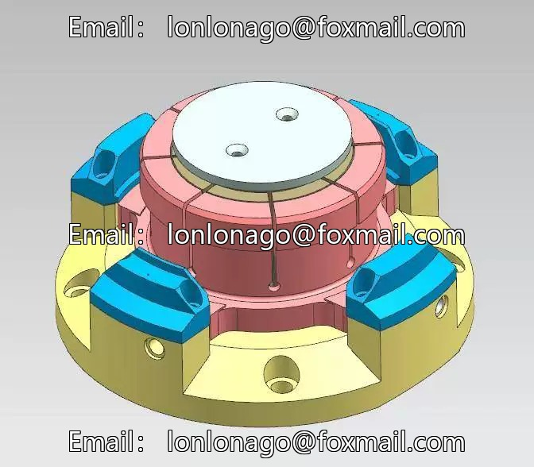

# CNC numerical control machine tool jig 3D drawings and specifications, seagull clamp, OK clamp, oblique internal support expansion

## Body

CNC numerical control machine tool jig 3D drawings, seagull clamp, OK clamp, oblique internal expanding
CNC numerical control machine tool jig 3D drawings, seagull clamp, OK clamp, oblique internal expanding sleeve, expanding core

3D drawings of CNC numerical control machine tool fixtures, seagull clamp, OK clamp, oblique inner bulging sleeve, bulging core, STP/X_T universal format, M6-M16 specifications, supports multiple 3D software

CNC Required Tooling 3D Files】STP/X_T General Auto-shipment

**Included Content:**
* Seagull Clamp 3D Model
* OK Clamp 3D Model (M6, M8, M10, M12, M14, M16 six specifications are complete!)
* CNC Oblique Inward-Expanding Clamp (Multi-Workstation Expansion Set + Expansion Core) 3D Model

**File Format:** STP / X_T (Step/Parasolid) Universal Three-Dimensional Format, **Packages can be opened for use!**

**Software Support:** NX (UG), Mastercam, SolidWorks, CATIA, Creo (ProE) and other mainstream CAD/CAM software can be opened and edited!

## Images

## Payment

Here is a pay link on Stripe ( https://buy.stripe.com/3cs8yP7sY87d0vu9AB ). Please contact me lonlonago@foxmail.com after funding $89, and I will send you a complete data files , thank you!

